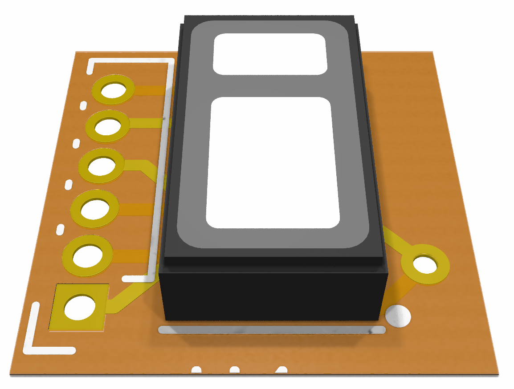

# TEG Sense SpO2 (Flex) Board

This is a small flex (or thin) board to hold an SpO2 sensor to be used with a [flex TEGSense device](https://github.com/TEGSense/hardware-flex).
It allows connecting the sensor via 0.1 inch contacts, easy for printed conductor applications.

## License

Shield: [![CC BY-SA 4.0][cc-by-sa-shield]][cc-by-sa]

This work is licensed under a
[Creative Commons Attribution-ShareAlike 4.0 International License][cc-by-sa].

[![CC BY-SA 4.0][cc-by-sa-image]][cc-by-sa]

[cc-by-sa]: http://creativecommons.org/licenses/by-sa/4.0/
[cc-by-sa-image]: https://licensebuttons.net/l/by-sa/4.0/88x31.png
[cc-by-sa-shield]: https://img.shields.io/badge/License-CC%20BY--SA%204.0-lightgrey.svg
